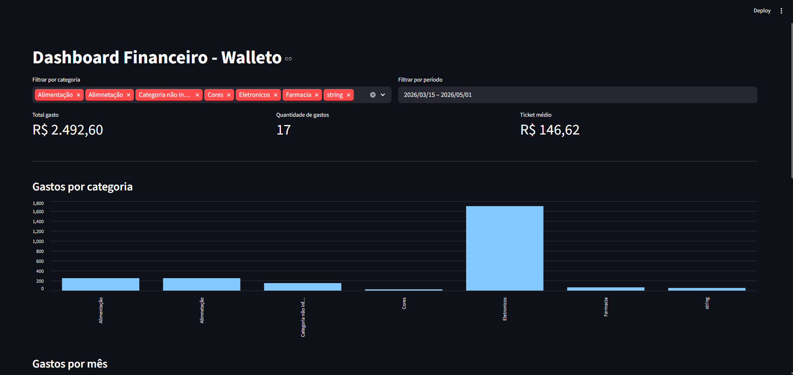

# 💰 Walleto 2.0

<p align="center">
  Sistema de controle financeiro desenvolvido em Python, com arquitetura em camadas e evolução para API REST.
</p>

<p align="center">
  
  
  
  
</p>

---

## 🧠 Sobre o Projeto

O **Walleto 2.0** é um sistema de controle financeiro desenvolvido em Python.

A versão atual (CLI) está **funcional, estável e organizada**, com regras de negócio bem definidas.  
O projeto está em evolução para uma **API REST**, visando integração com aplicações web e expansão do sistema.

---

## 📸 Dashboard

### 🔹 Visão geral

<p align="center">
  
</p>

---

### 🔹 Gráfico de gastos

<p align="center">
  
</p>

---

### 🔹 Últimos registros

<p align="center">
  
</p>

---

## ✅ Funcionalidades

- Cadastro, edição e remoção de gastos
- Filtros por data e categoria
- Persistência com SQLite
- Exportação para Excel (XLSX)
- Dashboard com visualização de dados
- Validações robustas

---

## 🧱 Arquitetura

```bash
src/
├── core/
├── models/
├── repositories/
├── services/
├── infrastructure/
└── views/
````

---

## ⚙️ Tecnologias

* Python
* SQLite
* Pandas
* OpenPyXL
* Streamlit
* Pytest

---

## 🚀 Evolução para API

O projeto está sendo adaptado para:

* FastAPI
* Pydantic
* SQLAlchemy
* Arquitetura limpa

---

## 🛠️ Instalação

```bash
git clone https://github.com/honoriio/walleto-2.0.git
cd walleto-2.0

python3 -m venv env

# Linux/macOS
source env/bin/activate

# Windows
env\Scripts\activate

pip install -r requirements.txt
```

---

## ▶️ Como executar

### CLI

```bash
python main.py
```

---

### Dashboard

```bash
streamlit run src/infrastructure/dashboard/streamlit_dashboard.py
```

---

## 🎯 Objetivo

Evoluir o Walleto para um backend completo, escalável e preparado para aplicações reais.

---

## 📬 Contato

* GitHub: [https://github.com/honoriio](https://github.com/honoriio)
